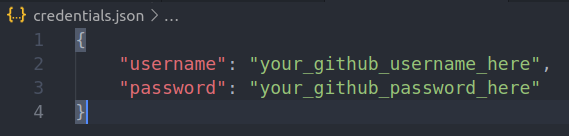
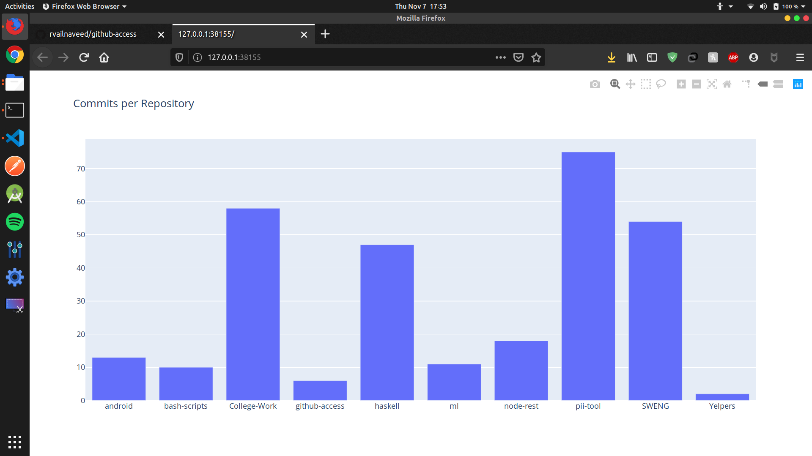

# github-access
Basic Implementation serving as the starting point for the Github Social Graph Project

## Instructions
+   Clone or download the repo: `git clone https://github.com/rvailnaveed/github-access.git`
+   Navigate to github_access: `cd path/to/the/repo/github-access`
+   Install Dependancies: `pip install -r requirements.txt`
+   Modify/create `credentials.json` with your Github username and password
+   Run `python graph_data.py`

